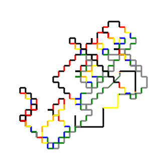

# Dr Logo-Js

Aplicacion HTML para dibujar con los cursores:

- Puede seleccionar un color de la lista
- **SHIFT** ocultar / mostrar la tortuga
- **CTRL** avanzar +10
- **ALT** disminuir -10
- **G** aumentar grosor de la línea

